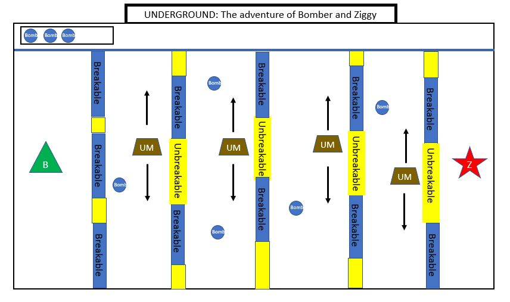
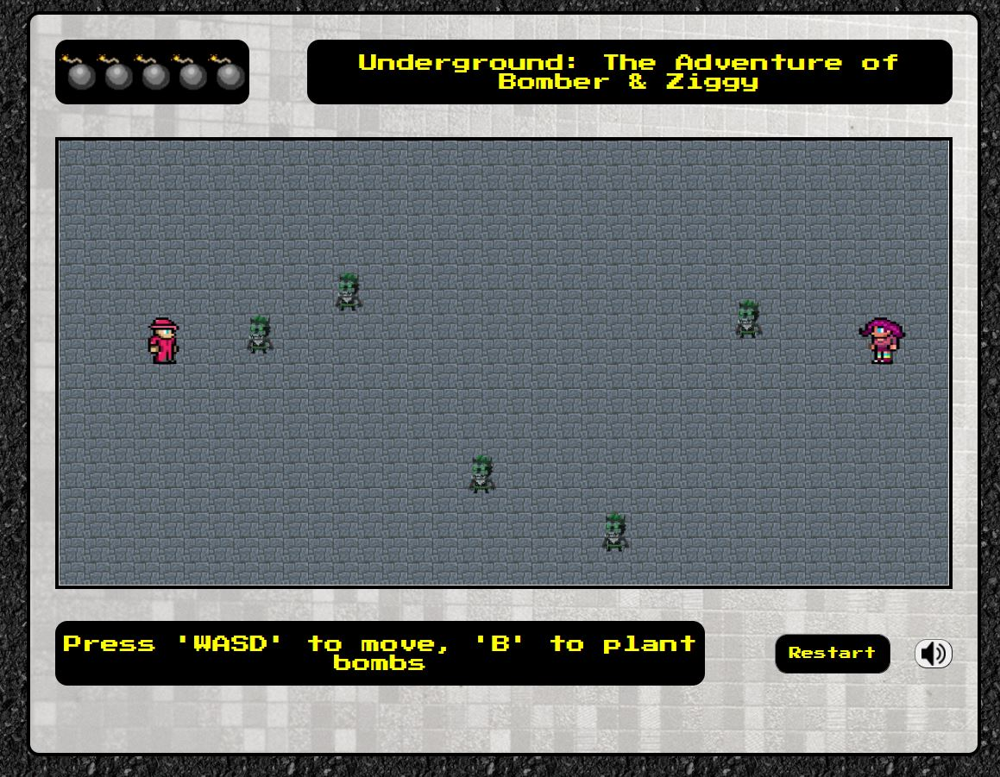

# Project1-bomber

In a city that's abundant in scraps and whatnots, you can find 2 Adventurers seeking for materials. An adventurer named Ziggy explored a nearby ruin while her find Bomber was collecting materials. 
Ziggy had slipped and fell in a hole that leads to an abandoned underground city. Little did she know that its not completely abandoned. 
Knowing that Ziggy was missing, Bomber went to the ruins and traverse his way towards the underground city to rescue Ziggy.

With the use of his personal homemade bombs, Help Bomber rescue his friend Ziggy from the hands of the underminers and escape the underground ruins. 
Don't fret, ziggy had unfortunately dropped some of her bombs along the corridors of the ruins. Bomber can pick those up and use it to break the walls of the ruins to save ziggy and defeat the underminers that crosses his way.

# Tech-to Use
* Grids/flexbox for the layout
* Canvas for the gameplay

# WireFrames
### First prototype


### Final product


# Try it out
[Project-Bomber](https://jondmc.github.io/Project1-bomber/)

# MVP Goals
* Be able to render bomber and ziggy.
* Be able to render 5 underminers with different x-y positions.
* Be able to move Bomber with the use of 'WASD'.
* Be able to plant bombs along ruins by pressing 'B'.
* Be able to stop the game once Bomber reach ziggy, or the underminers reach Bomber.
* Be able to display text to indicate whether bomber reached ziggy or be defeated by the underminers.
* A restart button

# Stretch Goals
* Be able to pick up bombs by running into it.
* Be able to update bomb holder.
* Be able to make the underminers move up and down continously within the canvas' space.
* Be able to destroy underminers with the bomb by placing it along the underminers' path.
* Be able to add audio/sfx.

# Code Higlights
A sample code function for planting bombs
```
function plantBomb(e){
    //by pressing 'b' bomber can plant a bomb in front of him
    if(e.key === 'b' || e.key === 'B'){
        //in order to plant bomb, he will check if he has some
        if(arrImg.length > 0) { 
            let bomb = new Pixel(bombImg,bomber.x+bomber.width,bomber.y,40,40) //creates a bomb in front of bomber
            arrBomb.push(bomb)                       //pushing to an array of bombs, to be rendered in the gameloop
            arrImg.pop()                            //removing the bomb used from the holder virtually
            document.querySelector('img').remove() //removing the bomb used from the holder physically

         }else display.innerText = 'No more Bombs :('
             
    }
}

```

# Future Stretch Goals && Refactorings
* Rendering random bombs along the map and be able to pick it up
* Rendering random enemies with random x-y positions within the space between bomber and ziggy
* Rendering walls with random x-y positions
* Animations for the character elements when they move
* Refactoring of the enemies' movements and render properties
* Refactoring collision detection for the character elements

# Credits
* Credits to google images, Imgbin , Favpng
* Credits to Sounds-Resource [Sounds-resource](www.sounds-resource.com)
* Credits to youtube for the music
