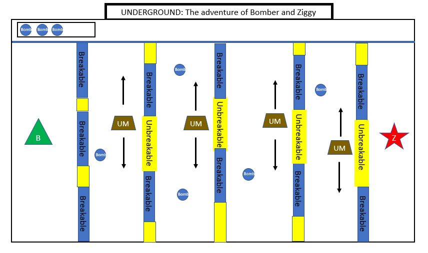

# Project1-bomber

In a city that's abundant in scraps and whatnots, you can find 2 Adventurers seeking for materials. An adventurer named Ziggy explored a nearby ruin while her find Bomber was collecting materials. 
Ziggy had slipped and fell in a hole that leads to an abandoned underground city. Little did she know that its not completely abandoned. 
Knowing that Ziggy was missing, Bomber went to the ruins and traverse his way towards the underground city to rescue Ziggy.

With the use of his personal homemade bombs, Help Bomber rescue his friend Ziggy from the hands of the underminers and escape the underground ruins. 
Don't fret, ziggy had unfortunately dropped some of her bombs along the corridors of the ruins. Bomber can pick those up and use it to break the walls of the ruins to save ziggy and defeat the underminers that crosses his way.

# Tech-to Use
* Grids/flexbox for the layout
* Canvas for the gameplay

# MVP Checklist
* Be able to render bomber, ziggy, and the underminers (with geometric figures).
* Be able to move Bomber with the use of 'WASD'.
* Be able to plant bombs along ruins by pressing 'B'.
* Be able to stop the game once Bomber reach ziggy.
* A restart button

# Stretch Goals
* Be able to add moving underminers.
* Be able to destroy underminers with the bomb by using Collision Detection.
* Be able to render the walls and destroy it.
* Be able to use sprites for the characters
* Be able to stop the game if the underminers reached Bomber or bomber gets hit with a bomb.
* Be able to change the level (i.e. the position of the walls, underminers,bombs; the pacing of the underminers,etc..)

# Potential Roadblocks
* Rendering images/sprites
* Animation of the images/sprites
* Collision Detection
* Timeout Interval for when the bomb explodes

